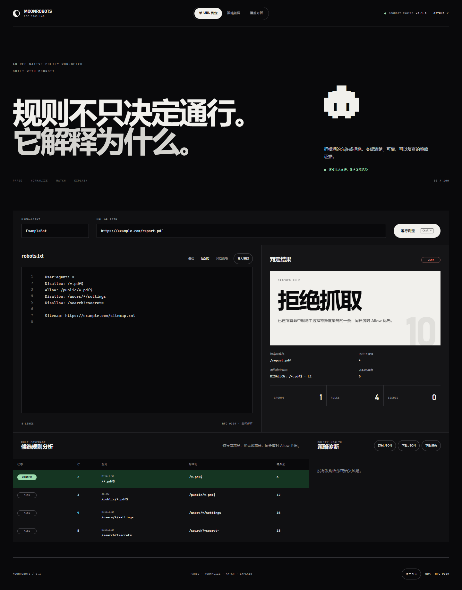
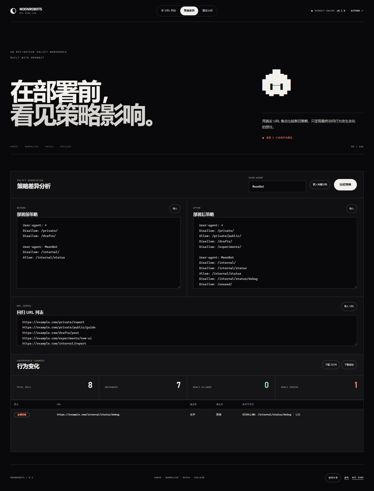

# MoonRobots

[](https://github.com/yrz12345/MoonRobots/actions/workflows/ci.yml)
[](https://github.com/yrz12345/MoonRobots/releases)
[](LICENSE)

MoonRobots 是一个使用 MoonBit 实现的可解释 `robots.txt` 解析与访问决策引擎。项目遵循 [RFC 9309](https://www.rfc-editor.org/rfc/rfc9309.html) 的核心语义，为搜索引擎、AI Agent、RAG 数据采集器、链接检查器及站点审计系统提供一致、可复查的爬虫策略判定。

项目同时提供 Windows 桌面工作台、核心库和原生命令行工具。每次判定不仅返回允许或拒绝结果，还会说明选中的 User-agent 分组、最终命中的规则、源文件行号、匹配特异度和候选规则轨迹。

**桌面版下载：<https://github.com/yrz12345/MoonRobots/releases>**

```text
robots.txt + crawler product token + URL
                    │
                    ▼
              MoonRobots engine
                    │
        ┌───────────┴───────────┐
        ▼                       ▼
   ALLOWED / DENIED       matched rule + line
```

## 核心能力

| 领域 | 能力 |
| --- | --- |
| 协议解析 | 容错解析 `User-agent`、`Allow`、`Disallow` 和 `Sitemap`，支持同名分组合并 |
| 规则匹配 | 最长规则优先；同长度冲突时 `Allow` 优先；支持 `*` 通配符和 `$` 结尾锚点 |
| URL 规范化 | 处理 UTF-8、百分号编码、路径与查询字符串，并隐式允许 `/robots.txt` |
| 可解释判定 | 返回命中规则、源码行号、决策原因、匹配特异度及完整候选规则轨迹 |
| 策略质量 | 检测重复规则、空分组、全站禁止、异常 Sitemap 及其他语义风险 |
| 变更分析 | 比较新旧策略，定位新增允许和新增拒绝的 URL |
| 动态覆盖率 | 识别活跃、被遮蔽和从未命中的规则 |
| 工具接口 | 提供 MoonBit 核心库、六个 CLI 命令、浏览器 API 及 JSON 输出 |
| 桌面工作台 | 支持单 URL 判定、策略差异、规则覆盖、文件拖放和 JSON/Markdown 导出 |
| 质量保障 | 在 Native、JavaScript、Wasm 和 Wasm-GC 后端执行测试，并运行浏览器回归检查 |





## 使用方式

### Windows 桌面版

从 [GitHub Releases](https://github.com/yrz12345/MoonRobots/releases) 下载最新版 Windows 安装程序。桌面工作台完全在本机运行，不会上传策略文件或 URL 数据，并提供三种模式：

- **单 URL 判定**：解释允许或拒绝结论、命中规则与全部候选规则。
- **策略差异**：使用同一组 URL 比较部署前后的最终访问行为。
- **覆盖分析**：统计规则匹配与胜出次数，识别被遮蔽和从未命中的规则。

策略文件和 URL 列表可通过按钮或拖放导入，分析结果可导出为 JSON 或 Markdown。所有解析与匹配均由应用内嵌的 MoonBit 编译产物完成。

### 本地开发

核心库开发需要近期版本的 MoonBit 工具链：

```powershell
moon update
moon check --target all --deny-warn
moon test --target all
```

桌面端开发还需要 Node.js 22、Rust stable、Microsoft C++ Build Tools 和 Windows SDK。安装依赖并启动开发模式：

```powershell
npm ci
npm run desktop:dev
```

构建 Windows NSIS 安装程序（构建脚本默认限制为单个 Cargo 并行任务，以降低 Windows 环境的内存占用）：

```powershell
npm run desktop:build
```

构建完成后，可直接分发的安装版和便携版统一输出到 `dist/`；`src-tauri/target/` 仅保存编译缓存和中间产物。

修改核心或浏览器 API 后，重新生成运行时：

```powershell
.\scripts\build-web.ps1
```

安装并执行网页质量检查：

```powershell
npm ci
npx playwright install chromium
npm run test:web
```

该检查覆盖首次使用引导、三种工作模式、文件导入、报告导出、基础无障碍规则、桌面/移动端水平溢出、触控尺寸和浏览器错误，并生成三张视觉回归截图。

### 命令行工具

判断单个 URL：

```powershell
moon run src/cmd/moonrobots --target native -- check examples/basic.txt --agent MoonBot --url https://example.com/admin/settings
```

机器可读输出：

```powershell
moon run src/cmd/moonrobots --target native -- check examples/basic.txt --agent MoonBot --url https://example.com/admin/settings --json
```

输出：

```text
DENIED
Crawler: MoonBot
Path: /admin/settings
Selected group: moonbot
Matched rule: Disallow: /admin/ (line 8)
Specificity: 7
Reason: the most specific matching rule was selected
```

检查文件结构：

```powershell
moon run src/cmd/moonrobots --target native -- inspect examples/basic.txt
```

显示非致命解析问题：

```powershell
moon run src/cmd/moonrobots --target native -- lint examples/malformed.txt
```

`lint` 会同时报告解析问题和语义风险，例如重复规则、空规则组、全站禁止规则、相对 Sitemap 以及跨组重复的 User-agent。

批量判断 URL：

```powershell
moon run src/cmd/moonrobots --target native -- batch examples/basic.txt examples/urls.txt --agent MoonBot
```

`batch` 同样支持 `--json`，输出中保留原始 URL、决策结果和汇总计数。

分析规则覆盖率：

```powershell
moon run src/cmd/moonrobots --target native -- coverage examples/policy-after.txt examples/regression-urls.txt --agent MoonBot
```

报告会为每条选中规则统计 `matched` 和 `won` 次数，并标记：

- `ACTIVE`：至少赢得过一次最终判定
- `SHADOWED`：能够匹配，但在当前 URL 语料中从未胜出
- `NEVER MATCHED`：当前语料没有覆盖这条规则

在部署新策略前执行回归比较：

```powershell
moon run src/cmd/moonrobots --target native -- diff examples/policy-before.txt examples/policy-after.txt examples/regression-urls.txt --agent MoonBot
```

`diff` 只报告最终访问行为发生改变的 URL，并区分 `NEWLY ALLOWED` 和 `NEWLY DENIED`。加入 `--json` 后可在 CI 中设置策略变更门禁。

## 作为库使用

```moonbit
let robots = @moonrobots.parse(
  (
    #|User-agent: *
    #|Disallow: /private/
    #|Allow: /private/public/
    #|
  ),
)

let decision = @moonrobots.evaluate(
  robots,
  "ExampleBot",
  "https://example.com/private/report",
)

if decision.allowed {
  println("allowed")
} else {
  match decision.matched_rule {
    Some(rule) => println("denied by line \{rule.line}: \{rule.pattern}")
    None => println("denied")
  }
}
```

需要展示完整决策过程时，使用 `evaluate_trace`：

```moonbit
let trace = @moonrobots.evaluate_trace(robots, "ExampleBot", "/private/report")
for candidate in trace.candidates {
  println(
    "line \{candidate.rule.line}: matched=\{candidate.matched}, specificity=\{candidate.match_length}",
  )
}
```

仅需要布尔结果时可以使用：

```moonbit
let allowed = @moonrobots.is_allowed(robots, "ExampleBot", "/docs/start")
```

策略回归与覆盖率也可作为核心库 API 使用：

```moonbit
let comparison = @moonrobots.compare_policies(before, after, "MoonBot", urls)
let coverage = @moonrobots.analyze_coverage(after, "MoonBot", urls)
```

`user_agent` 参数应当传入爬虫的 product token，例如 `Googlebot` 或 `MoonBot`，而不是完整 HTTP `User-Agent` 请求头。

## 决策规则

1. 对 product token 进行大小写不敏感的精确匹配。
2. 合并所有匹配相同 product token 的分组。
3. 如果没有精确匹配，则使用 `User-agent: *` 分组。
4. 将路径、查询字符串及规则规范化为可比较形式。
5. 收集所有命中的 `Allow` 和 `Disallow` 规则。
6. 选择最具体的规则；长度相同时选择 `Allow`。
7. 没有规则命中时默认允许。

## 项目结构

```text
src/
  types.mbt       public data model
  parser.mbt      fault-tolerant robots.txt parser
  normalize.mbt   URL extraction and percent normalization
  matcher.mbt     linear-time wildcard matcher and decision engine
  analysis.mbt    policy regression and dynamic rule coverage
  *_test.mbt      cross-backend tests
src/cmd/moonrobots/ native CLI
src/web_api/       browser-facing foreign library
web/               desktop workbench frontend assets
src-tauri/         Tauri desktop shell and Windows packaging
docs/screenshots/  documentation and regression screenshots
scripts/           reproducible web build and browser verification
examples/         runnable policies and URL lists
dist/              local distributable packages (ignored by Git)
package.json       reproducible Playwright web-quality checks
```

## 标准范围

当前版本实现 RFC 9309 的文件解析、分组选择、规则匹配、特殊字符、URL 编码比较和 `/robots.txt` 隐式允许语义。`Sitemap` 作为常见扩展被收集，但不影响分组。

以下内容属于后续路线，而不是 v0.1.0 的标准符合性声明：

- 自动下载 `/robots.txt`
- HTTP 重定向、状态码和缓存策略
- `Crawl-delay` 等非标准扩展
- Sitemap XML 下载与解析
- 完整网页爬虫

`robots.txt` 是自愿遵守的爬虫协议，不是身份认证、授权或数据安全机制。

## 质量检查

```powershell
moon fmt
moon check --target all --deny-warn
moon test --target all
moon info
moon build src/cmd/moonrobots --target native --release
npm ci
npm run test:web
```

## 路线图

- v0.1：解析、规则匹配、解释、策略回归、规则覆盖率、CLI、Windows 桌面工作台、跨后端测试
- v0.2：CSV 报告、Sitemap XML 解析和站点级历史趋势
- v0.3：HTTP 获取、条件请求和域名缓存
- v0.4：MCP Server、Agent 访问审计和抓取计划生成

## 许可证

[Apache-2.0](LICENSE)。项目为原创 MoonBit 实现；RFC 示例及术语归其各自规范所有。
